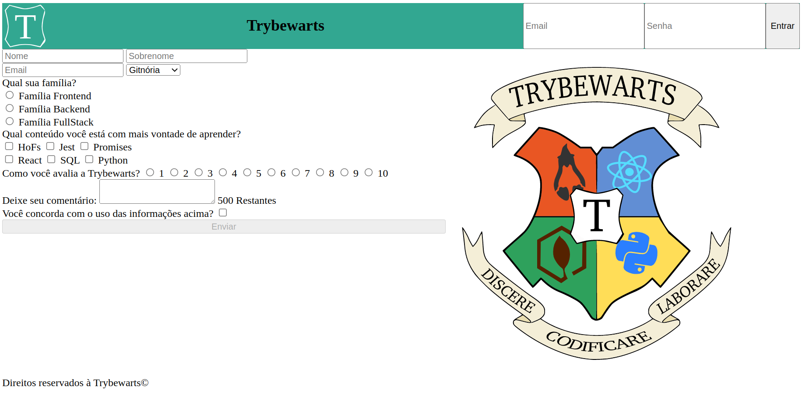

<h1> TrybeWarts </h1>

<h2> Sobre o projeto </h2>

 
Este projeto foi desenvolvido no curso de desenvolvimento Web, com proposta de utilizar as ferrasmentas HTML e CSS (CSS Flexbox).

 

<h2> Avaliação do Projeto </h2>

<url src="images/avaliacao.png"/>

<h2>Contato </h2>

 Para mais informações entre em contato: 

