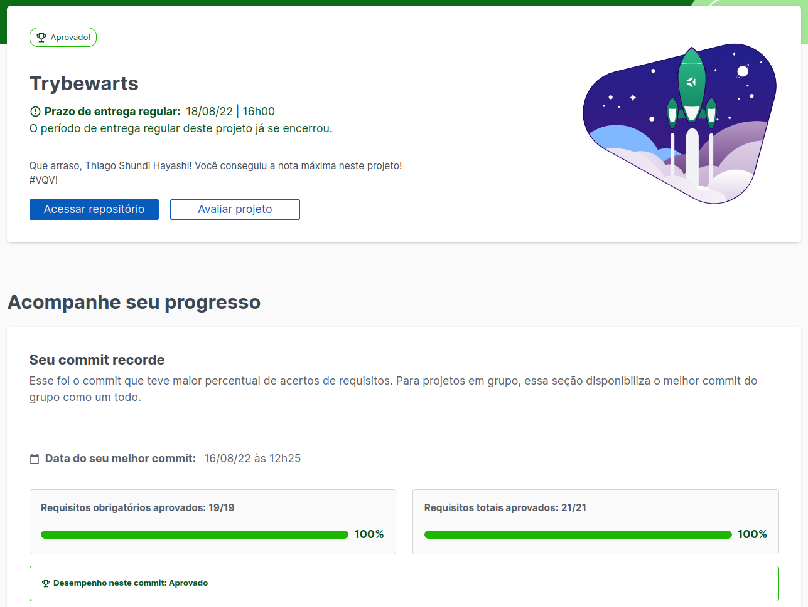

<h1> TrybeWarts </h1>

<h2> About the project </h2>

 
This project was developed in the Web development course, with the proposal to use HTML and CSS tools (CSS Flexbox).

 

<h2> Project Evaluation </h2>

<h2>Contact </h2>

 For more information contact us: 

